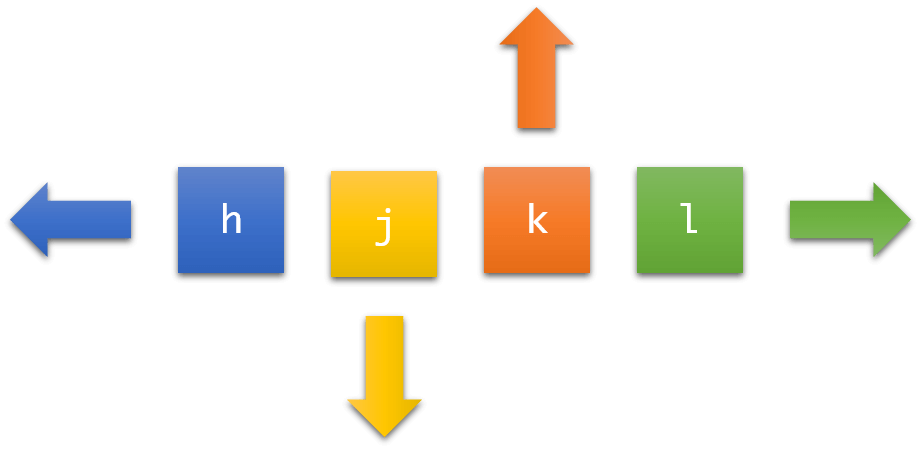

# Vim navigation

## Moving the cursor

- `h` - move left
- `j` - move down
- `k` - move up
- `l` - move right

## Word navigation

- `w` - jump forward to the start of the next word (punctuation counts as a separator.)
- `W` - jump forward to the start of the next word (punctuation is ignored, only whitespace splits.)
- `b` - jump backward to the start of a word
- `B` - jump backward to the start of a word (punctuation does not count as a word)
- `e` - jump forward to the end of a word

## Line navigation

- `0` - jump to the beginning of the line
- `^` - jump to the first non-blank character of the line
- `$` - jump to the end of the line

## Screen navigation

- `H` - jump to the top of the screen
- `M` - jump to the middle of the screen
- `L` - jump to the bottom of the screen
- `Ctrl+f` - move forward one full screen
- `Ctrl+b` - move backward one full screen
- `Ctrl+d` - move forward half a screen
- `Ctrl+u` - move backward half a screen
- `z Enter` - redraw the screen with the current line at the top

## File navigation

- `gg` - go to the first line of the file
- `:0` - go to the first line of the file
- `G` - go to the last line of the file
- `:$` - go to the last line of the file
- `ngg` - go to line n (e.g. `5gg` goes to line 5)
- `nG` - go to line n (e.g. `5G` goes to line 5)
- `:n` - go to line n (e.g. `:5` goes to line 5)

## Showing information

- `Ctrl+g` - show current line number and total lines in the file
