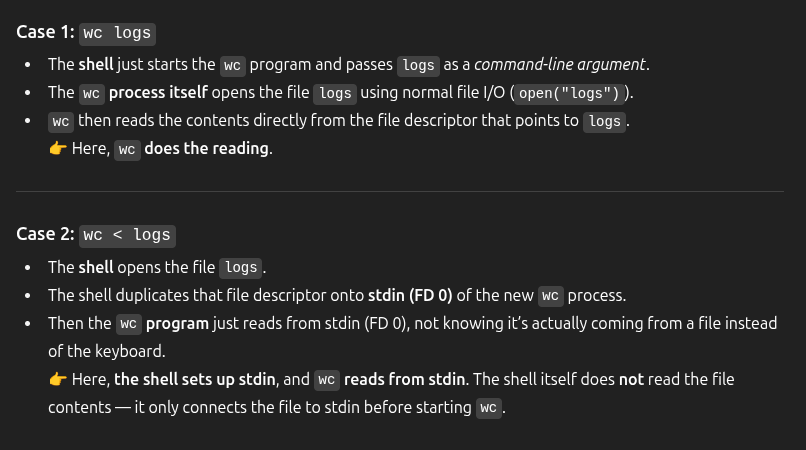
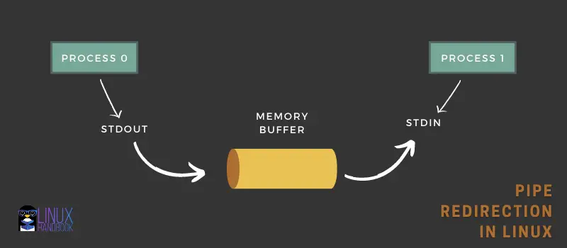

## Data streams

### Standard input - 0

- **default standard input is keyboard**
- **not all commands accept standard input, eg: wc, cat, grep**
- **wc (with no arguments) → waits for input from keyboard**
  - Enter wc command it will give to enter text - so this is the standard input
- **wc logs → reads from the file logs.**
- **wc < logs → redirects the file logs into stdin**

---

- **`wc logs`**: The program directly opens the file `logs` (does not use standard input)
- **`wc < logs`**: The shell opens the file and connects it to standard input (file descriptor 0), then `wc` reads from standard input

> To you as a user, both commands appear to produce the same result, but internally they work slightly differently.

### Standard output - 1

- **default standard output is terminal**
- **du Images 1> output.txt**

### Standard error - 2

- **default standard error is terminal**
- **du Images 2> output.txt**

### Redirect Both standard output and error

- **du Images &> output.txt**
- **du Images 1> output.txt 2> error.txt**

### /dev/null

- **apt install wget -y 1> /dev/null**
- **apt install wget -y 1> /dev/null 2> /tmp/error.txt**

### Command > output 2>&1 vs Command 2>&1 > output

- **du Images > output.txt 2>&1**

  - First redirect stdout to output.txt
  - Then redirect stderr to the same location as stdout

- **du Images 2>&1 > output.txt** (Redirects stderr to stdout, then stdout to output.txt)
  - First redirect stderr to stdout location (which means to the terminal)
  - Then redirect stdout to output.txt

---

## Pipes

### std error will not be piped to the next command

- **du Images | wc -l** (This will only count the lines of stdout, not stderr)
- **du Images 2>&1 | wc -l** (This will count the lines of both stdout and stderr)
