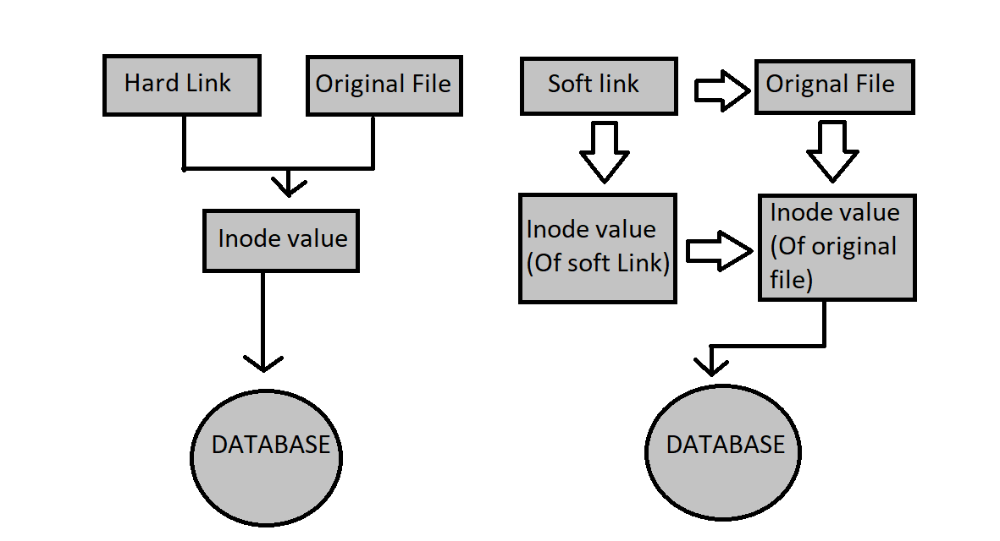

# Inodes

Think of an inode as the metadata record for a file. It contains everything about the file except its name and the actual data inside.

## What an inode stores

Each file or directory has its own inode, which contains information such as:

- **File type** (regular file, directory, link, etc.)
- **File size**
- **Permissions** (read/write/execute)
- **Ownership** (user and group)
- **Timestamps** (created, modified, last accessed)
- **Number of hard links**
- **Pointers to the actual data blocks on disk**

---

In Linux, a file is not stored as "name → data" directly.
Instead, Linux separates the file name from the actual file data. Understanding this requires knowing two important things:

- Directory
- Inode

---

## 1. Directory = Just a List of Names → Inode Numbers

A directory in Linux is actually a special type of file that contains a table like this:

| File Name   | Inode Number |
|-------------|-------------|
| notes.txt   | 45821       |
| photo.png   | 45822       |
| report.pdf  | 45823       |

> **Important idea:**
>
> - The directory only stores the file name and inode number
> - It does **NOT** store the file's data

So the directory acts like a phone book:

```
Name → phone number
File name → inode number
```

---

## 2. Inode = Metadata About the File

An inode is a data structure used by Linux filesystems (like ext4) to store information about a file.

The inode contains:

- File size
- Owner (user ID)
- Group
- Permissions (rwx)
- Timestamps
  - creation
  - modification
  - access
- Pointers to data blocks

But the inode does **NOT** store the file name.

**Example inode:**

```
inode: 45821
size: 2 KB
owner: kavindu
permissions: rw-r--r--
data blocks: 9211, 9212
```

---

## 3. Data Blocks = Where the Actual File Content Lives

The data blocks are the physical locations on disk where the real data is stored.

**Example for `notes.txt`:**

```
Block 9211 → "Linux file systems are..."
Block 9212 → "stored in blocks..."
```

---

## Complete Flow When You Open a File

Suppose you run:

```bash
cat notes.txt
```

Linux does this internally:

### Step 1 — Directory Lookup

Linux searches the current directory for `notes.txt`.

It finds:

```
notes.txt → inode 45821
```

### Step 2 — Inode Lookup

Linux reads inode 45821.

It learns:

```
data blocks → 9211, 9212
file size → 2 KB
permissions → rw-r--r--
```

Linux also checks if you have permission to read it.

### Step 3 — Read Data Blocks

Linux goes directly to disk blocks:

```
9211
9212
```

and reads the file content.

---

## Why Renaming a File Is Instant

When you rename:

```bash
mv notes.txt ideas.txt
```

Linux does not move the data blocks.

It simply changes the directory entry:

**Before:**
```
notes.txt → inode 45821
```

**After:**
```
ideas.txt → inode 45821
```

The inode and data blocks stay the same.

So even if the file is 50GB, renaming is almost instant.

---



---

## Hard Link

In the left part of your diagram, you see:

```
Hard Link   Original File
    \           /
     \         /
      Inode value
           |
        DATABASE
```

### Step-by-step explanation

**Original file is created**

Example:

```bash
touch fileA
```

Linux creates:

- a directory entry → `fileA`
- an inode → stores metadata
- data blocks → actual file content

Structure:

```
fileA → inode 5001 → data blocks
```

**Create a hard link**

```bash
ln fileA fileB
```

Now the directory looks like:

```
fileA → inode 5001
fileB → inode 5001
```

Both names point to the same inode.

That is exactly what your diagram shows:

```
Hard Link
    \
     → inode value → database (data blocks)
    /
Original File
```

Both go directly to the same inode.

**If the original file is deleted**

```bash
rm fileA
```

Then:

```
fileB → inode 5001 → data blocks
```

The file still exists because the inode still has one reference.

Linux deletes the data only when the link count becomes 0.

---

## Right Side of the Diagram — Soft Link

Now look at the right side of your diagram.

```
Soft link → Original File
        |
   Inode value (soft link)
        |
   Inode value (original file)
        |
     DATABASE
```

> **Important idea**
>
> A soft link is actually its own file.
>
> It has:
> - its own inode
> - its own data
>
> But the data stored inside is just the path to another file.

### Step-by-step

**Create original file**

```bash
touch fileA
```

Structure:

```
fileA → inode 5001 → data blocks
```

**Create soft link**

```bash
ln -s fileA fileB
```

Now Linux creates a new inode.

Structure:

```
fileB → inode 7001 → "fileA" (stored path)
```

So the chain becomes:

```
fileB
  ↓
inode 7001 (soft link inode)
  ↓
"path: fileA"
  ↓
inode 5001
  ↓
data blocks
```

This matches your diagram:

```
Soft link
    ↓
inode (soft link)
    ↓
inode (original file)
    ↓
database (data)
```

**If the original file is deleted**

```bash
rm fileA
```

Then the system becomes:

```
fileB → inode 7001 → "fileA"
```

But:

- `fileA` no longer exists
- So Linux cannot continue the chain.

Result:

```
broken symbolic link
```

---

## Key Difference Shown in Your Diagram

| Feature                        | Hard Link              | Soft Link                     |
|-------------------------------|------------------------|-------------------------------|
| Points to                      | Same inode             | File path                     |
| Own inode                      | ❌ No                  | ✅ Yes                        |
| Works after original deletion  | ✅ Yes                 | ❌ No                         |
| Structure                      | name → inode           | name → inode → path → inode   |
