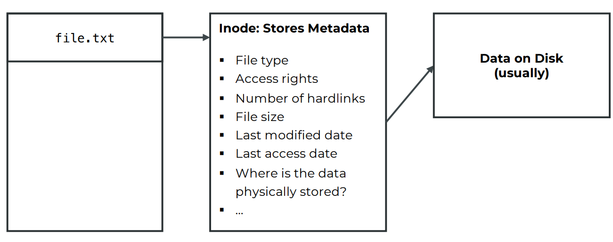
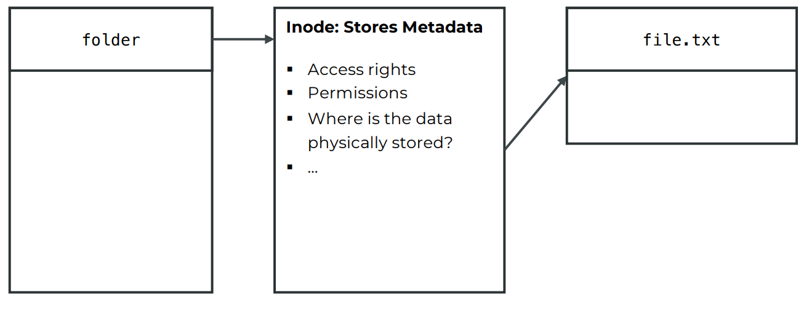
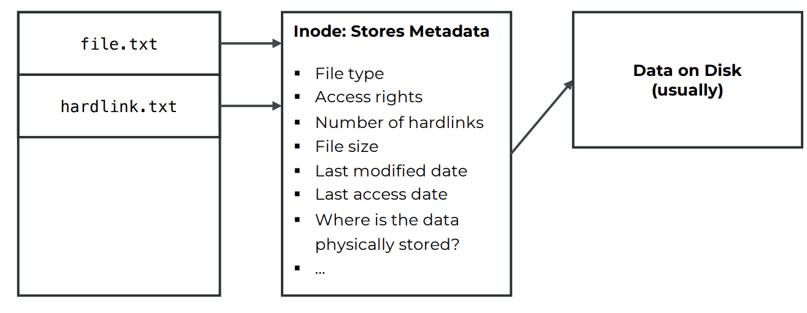

# Inodes

## What an inode stores

- Each file or directory has its own inode, which contains information such as:

  - **File type** (regular file, directory, link, etc.)
  - **File size**
  - **Permissions** (read/write/execute)
  - **Ownership** (user and group)
  - **Timestamps** (created, modified, last accessed)
  - **Number of hard links**
  - **Pointers to the actual data blocks on disk**

### File Inode

  

### Directory Inode

## What it does not store

- The **file name** is not in the inode.
- File names are stored in the **directory entry**, which maps a name to its inode number.

## How it works

1. When you open a file, Linux looks up its inode number in the directory.
2. Then it uses the inode to find where the file’s data is actually stored on disk.

> **So in short:**  
> The directory gives you the file name → which points to an inode → which points to the data.

## Symbolic link files

- A symbolic link is more like a shortcut or pointer.
- It has its own inode (different from the original file’s inode).
- The symbolic link’s inode just stores the path of the target file.
- If the target file is deleted, the symbolic link becomes broken (dangling symlink).
- Can span across different file systems.

## Hard link files

- A hard link is basically another name for the same file.
- It points directly to the same inode as the original file.
- Since they share the same inode:
- They share the same data and metadata (except for the name and directory location).
- Deleting one name doesn’t delete the file until all hard links are removed (the inode’s link count becomes zero).
- Restriction: Hard links cannot span across different file systems or partitions.
